# BaseMiniApp
Base Mini Appを学習するためのサンプルリポジトリです。

## テンプレプロジェクト生成コマンド

```bash
npx create-onchain@latest --mini
```

## ビルド＆ローカルでの起動

- ビルド

  ```bash
  pnpm run build
  ```

- ローカルで起動

  ```bash
  pnpm run dev
  ```

## vercelにデプロイする

```bash
vercel
```

以下の2つの環境変数をVercel上で設定する

```txt
NEXT_PUBLIC_CDP_CLIENT_API_KEY=<CDPで生成したAPIキー>
NEXT_PUBLIC_URL=<vercelでデプロイされた後に決定されるアプリのURL(例えば https://my-minikit-app-delta.vercel.app/ などになる)>
```

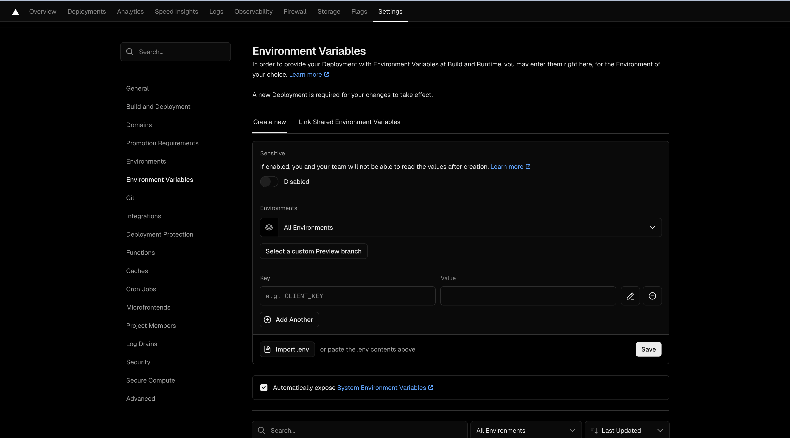

FarcasterでdeployされたアプリのURLをそのままコピペしてcastする

[castまでのURL](https://farcaster.xyz/mashharuki/0x534f6740)

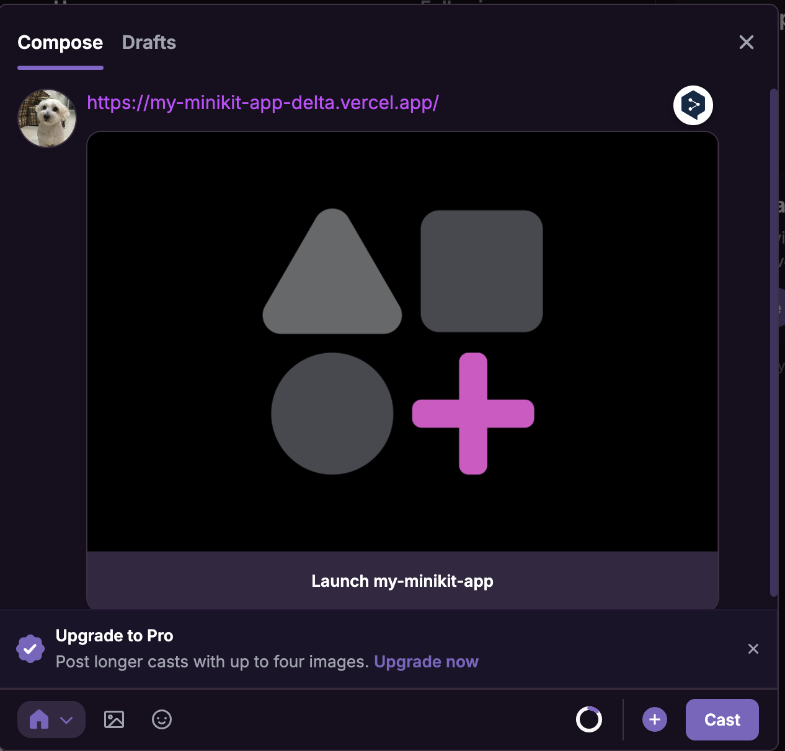

`Launch my-minikit-app` ボタンを押すと確認が求められるのでそのまま承認する

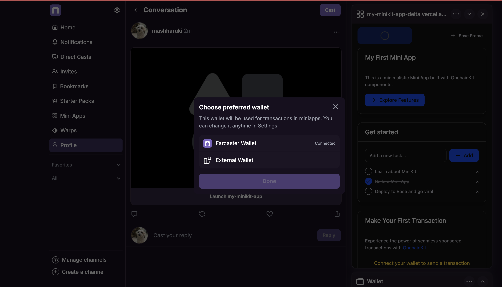

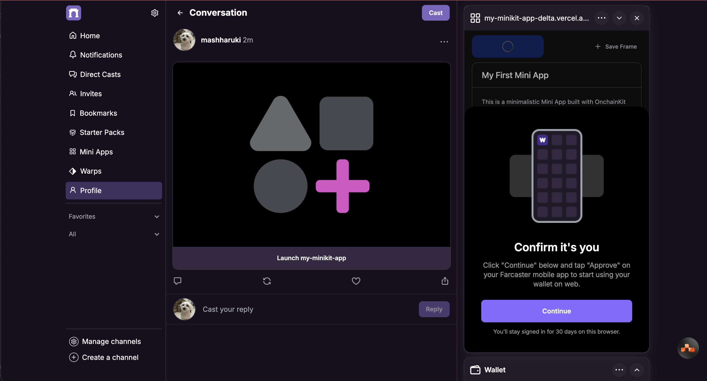

そうするとMiniAppが起動する

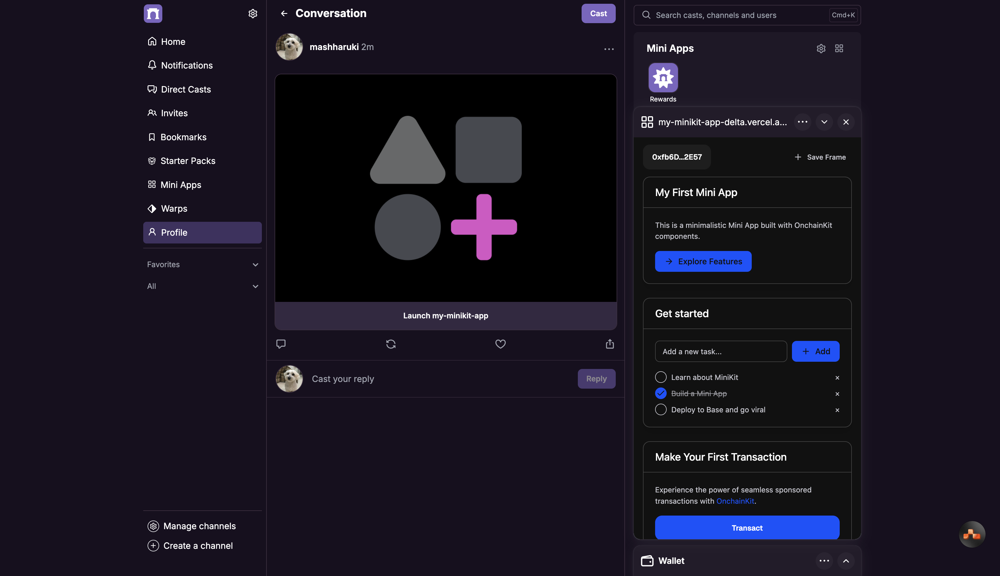

`Transact`ボタンを押すとトランザクションが実行される

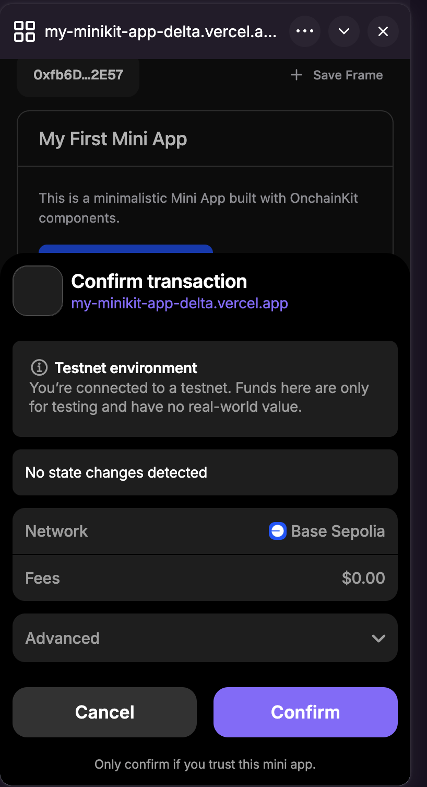

しばらくするとトランザクションが取り込まれ処理が完了する！

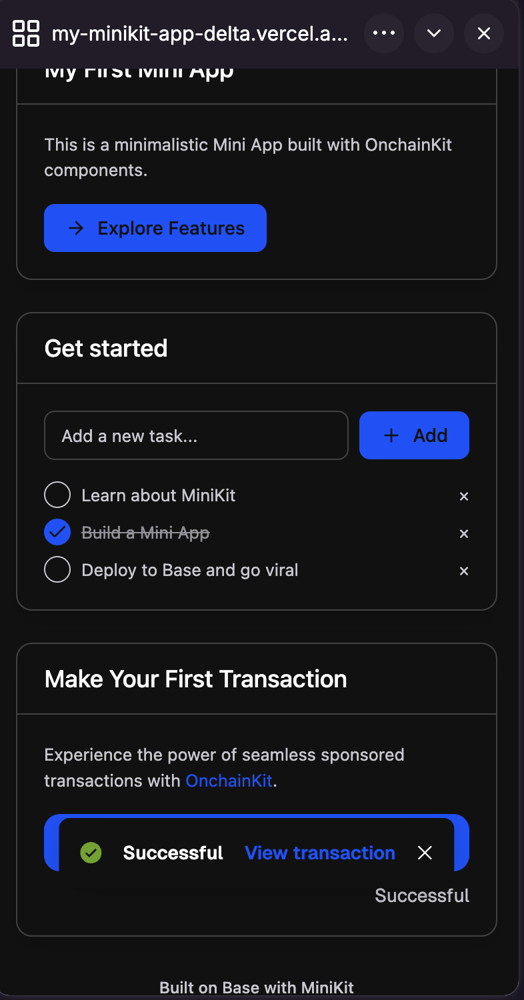

実際に発火させたトランザクションは以下から確認ができます。

[baseSepolia - 実際に実行したトランザクション](https://sepolia.basescan.org/tx/0x01dea3754d68940b28af20c2c11fb7edba185a6096df2b2dcac28b69ac1eda38)

My Mini Appに追加した時のイメージ

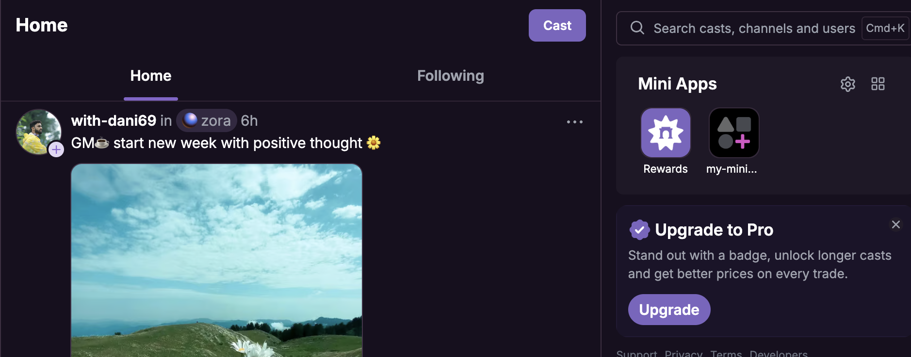

## Farcaster用のanifestファイル生成コマンド

```bash
npx create-onchain --manifest
```

このコマンドを実行する前に`Farcaster`のアプリの設定から`Farcaster`で使っているウォレットの秘密鍵をエクスポートし、Metamaskにインポートしておく必要がある

FarcasterのSettingsからも生成できる方法を発見！

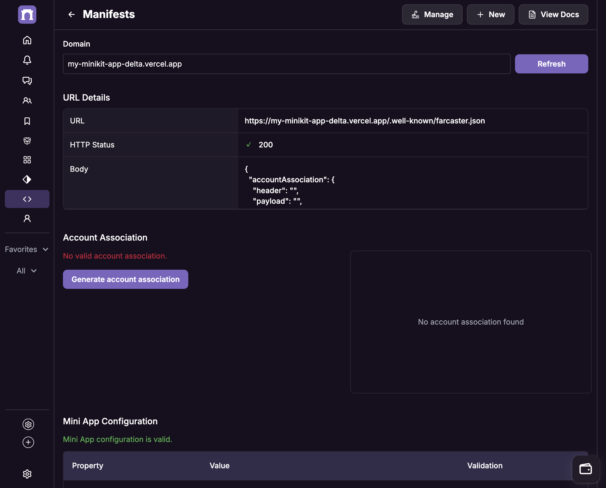

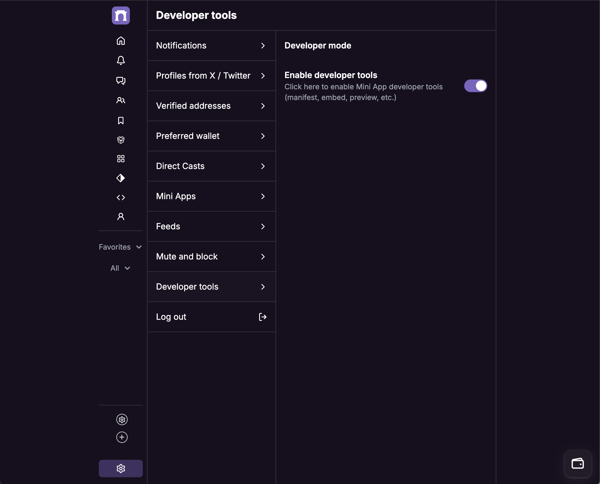

## ローカルで起動させた時のスクショ

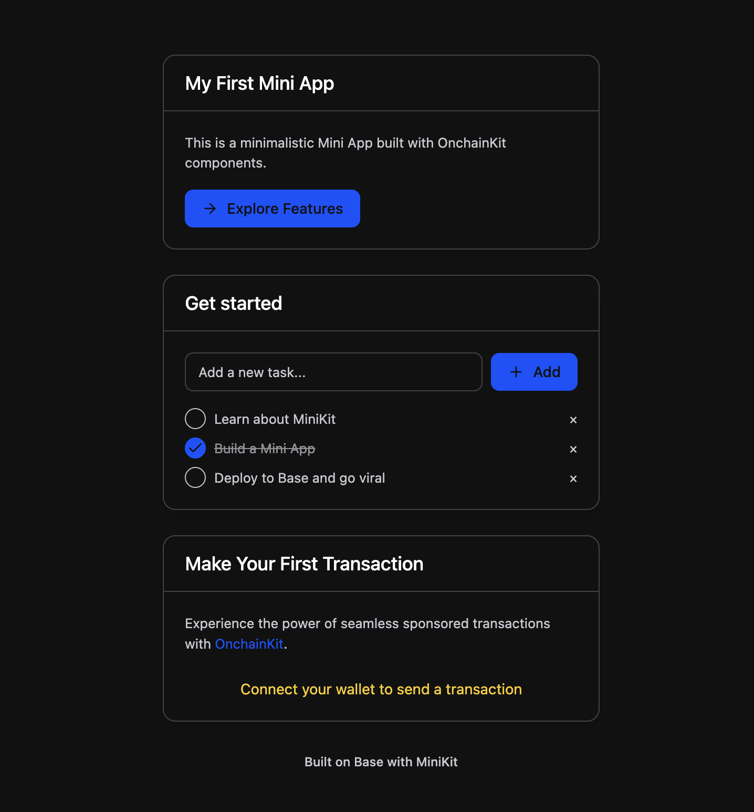

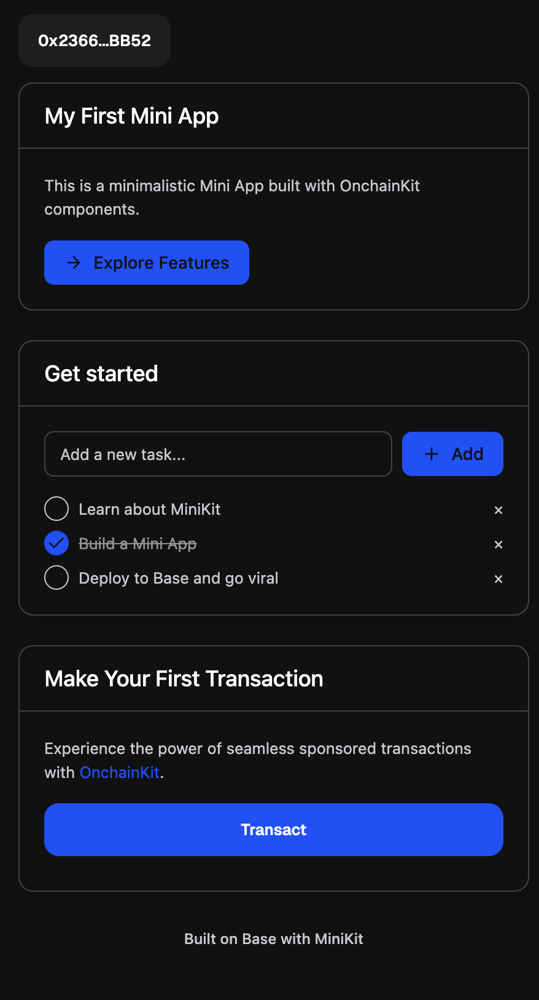

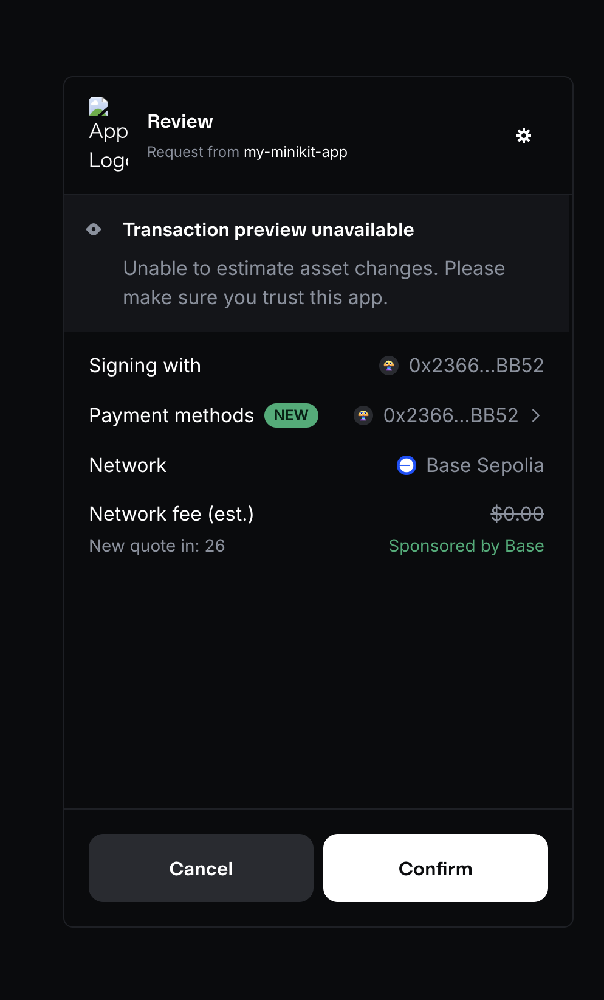

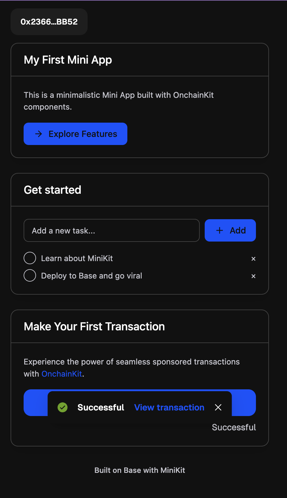

## Base Buildへの登録

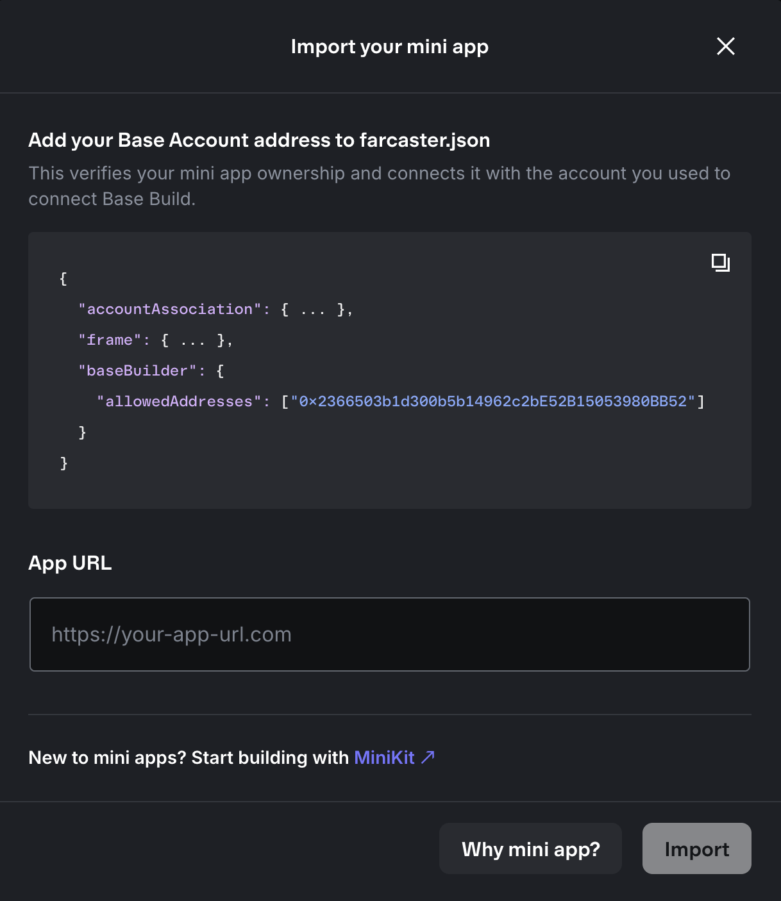

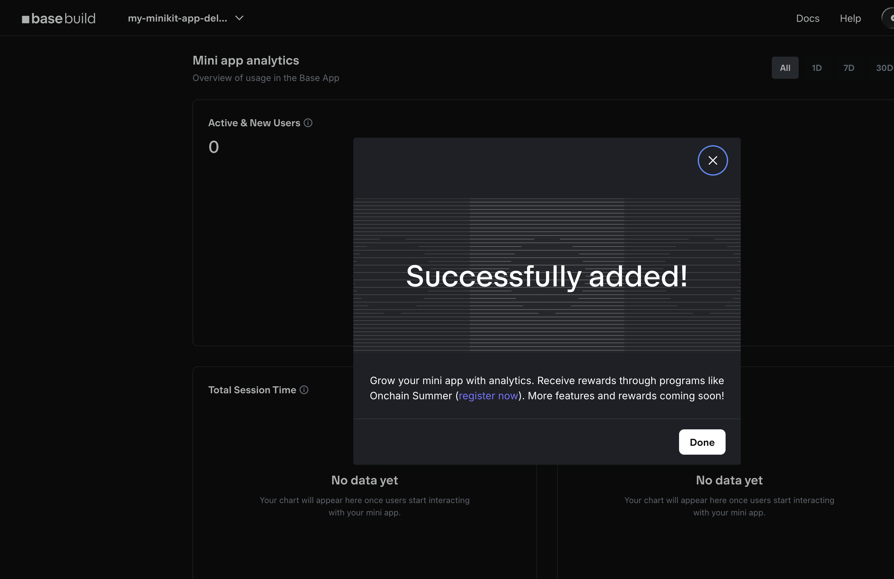

## テストネットにデプロイしたNFT(ERC1155)

[0xd52dd0dcf92ff5714402ef9f3cb5f8a75bdccf37](https://sepolia.basescan.org/address/0xd52dd0dcf92ff5714402ef9f3cb5f8a75bdccf37)

[rarible - 0xd52dd0dcf92ff5714402ef9f3cb5f8a75bdccf37](https://testnet.rarible.com/collection/base/0xd52dd0dcf92ff5714402ef9f3cb5f8a75bdccf37/items)

## 参考文献
- [Base Docs MiniApp](https://www.base.org/build/mini-apps)
- [MiniApp クイックスタート](https://docs.base.org/mini-apps/quickstart/new-apps/install)